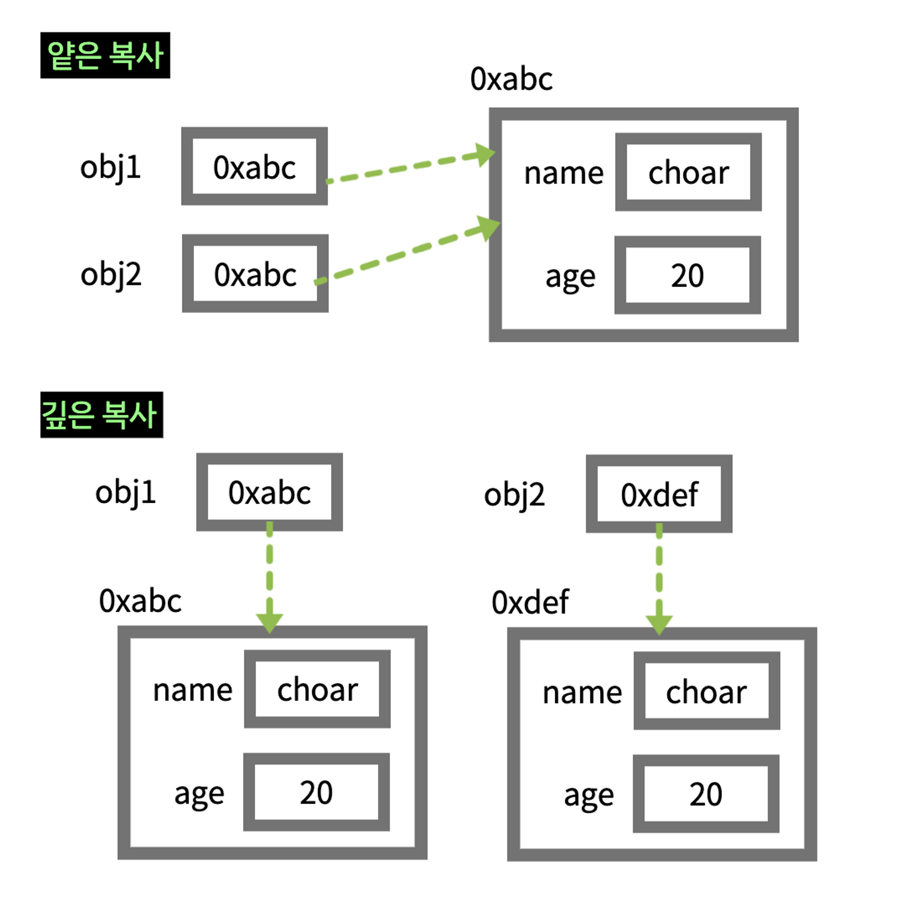

# Shallow Copy vs Deep Copy

객체의 메모리 주소값을 복사하는 것을 얕은 복사, 실제값을 복사 하는 것을 깊은 복사라고 한다.

<br>



<br>

## 얉은 복사

-   값 자체를 복사하는 것이 아니라 `주소값을 복사`하여 같은 메모리를 가리킨다.
-   참조형(reference type)을 복사하는 경우 얕은 복사가 일어난다.

```js
let obj1 = { num: 1 };
let obj2 = obj1;

obj1.num = 123;

console.log(obj1); // {num: 123}을 출력
console.log(obj2); // {num: 123}을 출력 (obj2에 할당되었던 {num: 1}의 내용이 obj1을 따라 변경)
```

<br>

## 깊은 복사

-   새로운 메모리 공간에 독립적인 실제값이 복사된다.
-   기본형(Primitive type)을 복사하는 경우 깊은 복사가 일어난다.

```js
let x = 1;
let y = x;

x = 123;

console.log(x); // 123을 출력
console.log(y); // 1을 출력 (y에 할당되었던 1이 변경되지 않음)
```
